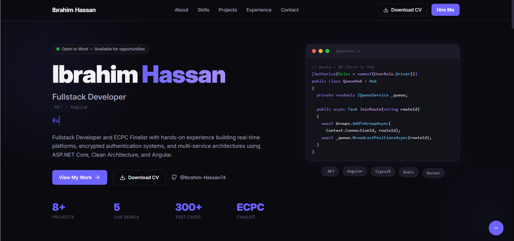

# Ibrahim Hassan | Developer Portfolio

A modern, high-performance personal portfolio website built to showcase my backend and full-stack engineering work. It emphasizes clean aesthetics, smooth scroll animations, and a fully responsive design.



## Live Demo

**[ibrahimhassan.dev](https://ibrahimhassan.dev)**

## Tech Stack

- **Framework:** [Angular 19](https://angular.dev/) (Standalone Components, Signals, new Control Flow)
- **Styling:** [Tailwind CSS v4](https://tailwindcss.com/) (Custom UI, Dark Mode, Glassmorphism, Micro-animations)
- **Icons:** [Lucide Angular](https://lucide.dev/)
- **Carousels:** [Swiper Elements](https://swiperjs.com/) (Custom pagination and navigation)
- **Deployment:** Vercel / Netlify / GitHub Pages

## Key Features

- **Dynamic Design:** Implements modern web design best practices including vibrant accents, sleek dark mode aesthetics, and glassmorphism (backdrop blurs).
- **Smooth Animations:** Custom IntersectionObserver directives for buttery smooth scroll-triggered reveal animations.
- **Responsive Mobile Menu:** Full-screen animated mobile navigation overlay.
- **Clean Architecture:** Well-structured Angular project using standalone components, strict typing, and centralized data configuration (`portfolio.data.ts`).
- **Performance Optimized:** Lightweight DOM, efficient signals-based change detection, and native CSS transitions.

## Local Development

To run this project locally:

1. **Clone the repository:**

   ```bash
   git clone https://github.com/Ibrahim-Hassan74/portfolio.git
   cd portfolio
   ```

2. **Install dependencies:**

   ```bash
   npm install
   ```

3. **Start the development server:**
   ```bash
   ng serve
   ```
   Navigate to `http://localhost:4200/`. The app will automatically reload if you change any of the source files.

## Customizing Content

All personal data, projects, skills, and contact links are centralized in `src/app/data/portfolio.data.ts`.
To use this template for yourself, simply modify the data in that file—no need to dig through HTML components!

## License

This project is open-source and available under the [MIT License](LICENSE).
